# FlowDesk: System Blueprint

**Version:** 1.0
**Date:** 2026-05-18
**Audience:** Management (for go-live approval), Operations, Implementation Team
**Status:** _For management review_

> All diagrams in this document are written in **Mermaid**. They render as visual graphs in GitHub, VS Code (Mermaid Preview extension), Notion, Confluence, and most modern markdown viewers. If a viewer does not render them, paste the diagram code into <https://mermaid.live> to see the image.

---

## Table of Contents

1. [Executive Summary](#1-executive-summary)
2. [What FlowDesk Does: In Plain English](#2-what-flowdesk-does-in-plain-english)
3. [The Big Picture: System Architecture](#3-the-big-picture-system-architecture)
4. [Who Uses It: Roles & Permissions](#4-who-uses-it-roles--permissions)
5. [A Day in the Life: A Form's Journey](#5-a-day-in-the-life-a-forms-journey)
6. [The Approval Engine: Form Lifecycle](#6-the-approval-engine-form-lifecycle)
7. [Database Blueprint](#7-database-blueprint)
8. [API Catalogue](#8-api-catalogue)
9. [How Frontend, Backend, and Database Work Together](#9-how-frontend-backend-and-database-work-together)
10. [PDF & Document Pipeline](#10-pdf--document-pipeline)
11. [Email & Notifications](#11-email--notifications)
12. [Delegation Engine](#12-delegation-engine)
13. [Multi-Tenant Isolation](#13-multi-tenant-isolation)
14. [Security](#14-security)
15. [Deployment & Infrastructure](#15-deployment--infrastructure)
16. [Go-Live Readiness Checklist](#16-go-live-readiness-checklist)
17. [Glossary](#17-glossary)

---

## 1. Executive Summary

**FlowDesk** is a multi-tenant Software-as-a-Service (SaaS) platform that replaces paper and email-based approval workflows. Staff initiate forms (leave requests, purchase requisitions, training requests, etc.), the system routes them through an approval chain, captures signatures, generates a signed PDF, and archives everything with a complete audit trail.

| What it solves | How |
|---|---|
| Paper forms get lost, signed out of order, or skip approvers | Digital approval chain enforces order; system tracks every step |
| Approvers are out of office and forms stall | Delegation engine lets work hand off automatically |
| No record of who approved what, when | Every action writes to the audit log; signatures are stored cryptographically |
| Forms look different every time | Admin-designed templates produce identical, branded PDFs |
| Hard to know what's pending | Role-aware dashboards show each user only what they need to do |

**Technical fit at a glance**

- **Frontend:** React 18 single-page app, served by Nginx
- **Backend:** FastAPI (Python) REST API
- **Database:** PostgreSQL 16
- **Containerized:** Docker Compose (three containers: `nginx`, `api`, `db`)
- **Hosted:** On-premises at `10.20.26.47/flowdesk/` behind the BSC reverse proxy

**Readiness:** All core flows (submit, approve, reject, send-back, delegate, PDF export, audit) are complete and exercised in production-like environments. See [Section 16: Go-Live Readiness Checklist](#16-go-live-readiness-checklist).

---

## 2. What FlowDesk Does: In Plain English

Imagine the **Leave Request** form your team currently does on paper:

1. You write it out.
2. You walk it to your line manager for a signature.
3. Your line manager walks it to HR.
4. HR walks it to the Head of Department.
5. Someone signs it.
6. The signed copy gets filed somewhere.
7. Two months later, nobody can find it.

**FlowDesk replaces every step of that:**

- **Step 1** → You log in, pick "Leave Request" from a list, fill it out on your phone or laptop, sign with your finger or a typed signature, and click **Submit**.
- **Steps 2–5** → The system instantly notifies your line manager by email. They click the link, see the form, sign, approve. Next approver gets notified automatically. Repeat until the chain is complete.
- **Step 6** → The system generates a single PDF with your organisation's letterhead, every signature in place, a unique reference number (e.g., `BSC-LRQ-2026-0042`), and an audit trail showing exactly who did what and when.
- **Step 7** → That PDF is permanently archived in the system. Anyone with access can look it up by reference number, status, or date.

The system also handles the **awkward cases**: what if the manager is on leave? (Delegation.) What if HR sends it back asking for a change? (Correction cycle.) What if a manager rejects it outright? (Rejection workflow.) What if you need to attach a doctor's note? (Attachments.)

Everything is **organisation-isolated**: BSC's data never leaks to another tenant on the same platform.

---

## 3. The Big Picture: System Architecture

The system has four layers, each with a clear job. The diagram below shows how a user's click flows from their browser all the way down to the database and back.

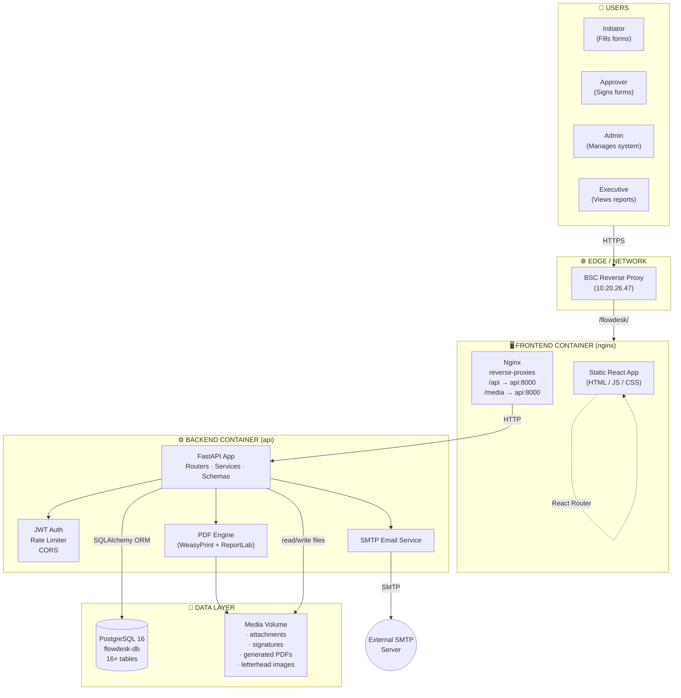

### What each layer does

| Layer | Container | Job | Technology |
|---|---|---|---|
| **Edge** | (host network) | Front door: terminates HTTPS, routes by URL prefix to FlowDesk vs. other BSC apps | Nginx on host |
| **Frontend** | `flowdesk-nginx` | Serves the React app + reverse-proxies API calls. The user's browser does the work after the first page loads. | Nginx Alpine |
| **Backend** | `flowdesk-api` | The brain. Enforces rules, runs workflows, generates PDFs, sends email, writes the audit log. | FastAPI / Python 3.12 |
| **Database** | `flowdesk-db` | Source of truth: every form, user, signature, decision. | PostgreSQL 16 |
| **Media volume** | shared with `flowdesk-api` | Files that don't belong in the database: uploaded attachments, signature images, final PDFs, organisation letterhead. | Docker named volume |

---

## 4. Who Uses It: Roles & Permissions

FlowDesk has **two role dimensions** working together:

1. **Hierarchy**: who is whose manager (Line Manager → Senior Manager → Head of Department).
2. **Functional / System roles**: what someone can *do* in the system (Admin, Approver, Initiator, etc.).

When admins design an approval template, they pick from these:

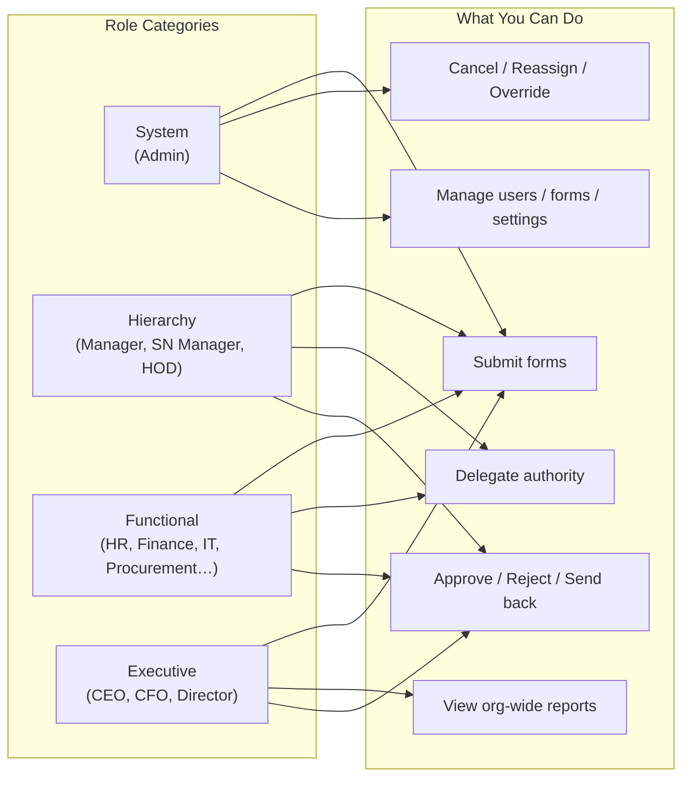

### Privilege tiers used by the UI

| Tier | Who | Sees |
|---|---|---|
| **Admin** | System administrators | Everything: users, forms, templates, all submissions, audit log, settings |
| **Report Manager** | Department managers with reporting rights | Department-scoped dashboard, can create users |
| **Executive** | C-suite | Org-wide read-only dashboard, approves executive-tier forms |
| **HOD** | Head of Department | Own submissions + department approval queue |
| **Approver** | Anyone in an approval chain | Pending-approvals inbox + history |
| **Initiator** | Default (every employee) | Submit forms, view own forms |
| **Observer** | Read-only auditors | Org-wide read of completed documents |

Each user can hold **multiple roles** simultaneously (e.g., a Finance Manager is both an Approver and a Line Manager).

---

## 5. A Day in the Life: A Form's Journey

This is the single most important diagram for understanding the system. It walks through a **Leave Request** from "Maria clicks submit" to "the signed PDF is downloadable in the archive".

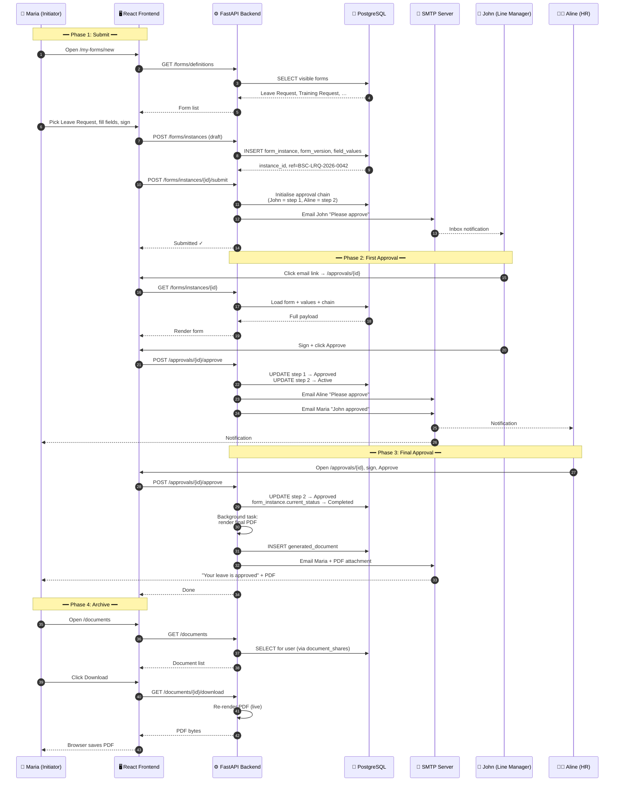

**Why this matters:** every arrow in that diagram is a real, audited, recoverable action. If John approves but the email to Aline fails, the database state is still correct: Aline still sees it in her inbox when she logs in, because the system queries the database, not the email.

---

## 6. The Approval Engine: Form Lifecycle

A form is never just "open" or "closed". It moves through a defined set of states. Every transition is gated by a permission check and writes to the audit log.

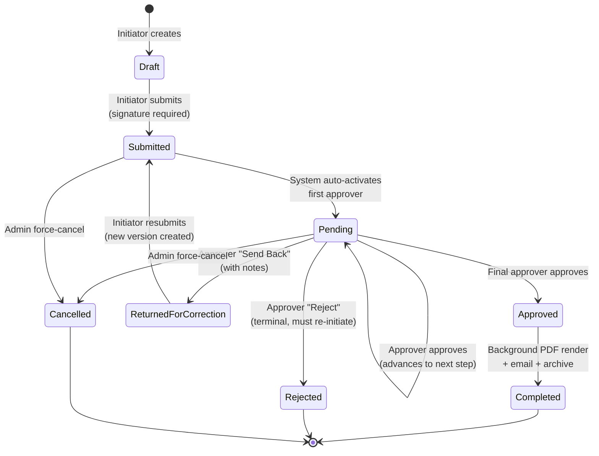

### State definitions

| State | What it means | Who can move it |
|---|---|---|
| **Draft** | Saved but not yet submitted | Initiator |
| **Submitted** | Submitted, approval chain initialised, awaiting first approver | System (auto) |
| **Pending** | Mid-flight in approval chain | Next approver in line |
| **Returned for Correction** | An approver sent it back with notes | Initiator (resubmits) |
| **Rejected** | Terminal: chain ended in rejection | (Initiator may re-initiate a fresh form) |
| **Approved** | Final approver said yes, awaiting PDF generation | System (auto) |
| **Completed** | Final PDF generated and archived | (Terminal) |
| **Cancelled** | Admin override | (Terminal) |

### Versioning

Every send-back creates a **new version** of the form. The original is preserved (with its rejected approvals); the new version starts fresh. This means an audit trail of "what changed" is always available.

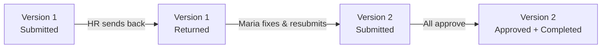

---

## 7. Database Blueprint

The database has **16 core tables** plus 2 junction tables. Every table includes `organization_id` for tenant isolation. Below is the entity-relationship diagram, then a detailed table-by-table breakdown.

### 7.1 Entity-Relationship Diagram

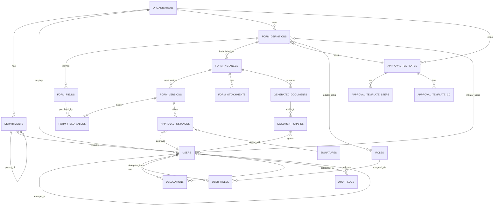

### 7.2 Tables: Master Reference

#### Tenant & Identity

| Table | Purpose | Key Columns |
|---|---|---|
| **organizations** | The tenant. Each one is fully isolated. | `id`, `name`, `subdomain`, `email_domain`, `header_image_path`, `footer_image_path`, `letterhead_accent`, `classification_labels` (JSON) |
| **departments** | Hierarchical org structure. Departments can have sub-departments. | `id`, `organization_id`, `name`, `parent_department_id` |
| **users** | Every person who can log in. | `id`, `organization_id`, `name`, `email`, `password_hash`, `department_id`, `manager_id`, `sn_manager_id`, `hod_id`, `status`, `mfa_enabled`, `must_reset_password` |
| **roles** | Functional + system + executive + hierarchy roles. | `id`, `organization_id`, `name`, `role_category` |
| **user_roles** | Junction: which user has which role. | `user_id`, `role_id`, `assigned_by` |
| **password_reset_tokens** | Time-bound reset links emailed to users. | `id`, `user_id`, `token`, `expires_at`, `used` |

#### Form Templates (designed by admins)

| Table | Purpose | Key Columns |
|---|---|---|
| **form_definitions** | A form template (e.g., "Leave Request"). | `id`, `name`, `printed_title`, `code_suffix`, `visibility`, `pdf_template_path`, `confidentiality`, `approval_template_id`, `section_layouts` (JSON) |
| **form_fields** | The fields inside a template: labels, types, validation. | `id`, `form_definition_id`, `field_label`, `field_type`, `section_name`, `required`, `validation_rules` (JSON), `auto_filled`, `auto_fill_source`, `calculation_formula`, `grid_width`, `display_order` |
| **form_definition_initiator_roles** | Junction: which roles may initiate this form. | `form_definition_id`, `role_id` |
| **form_definition_initiator_users** | Junction: which specific users may initiate. | `form_definition_id`, `user_id` |
| **approval_templates** | A named approval workflow (reusable across forms). | `id`, `name`, `restart_on_correction` |
| **approval_template_steps** | The ordered steps inside an approval template. | `id`, `template_id`, `step_order`, `step_label`, `role_type`, `role_id`, `specific_user_id`, `hierarchy_level`, `is_required` |
| **approval_template_cc_recipients** | People CC'd on completion (for visibility). | `template_id`, `role_type`, `role_id`, `specific_user_id`, `email` |

#### Form Submissions (created by users)

| Table | Purpose | Key Columns |
|---|---|---|
| **form_instances** | A single submitted form, one per "Maria's leave request". | `id`, `form_definition_id`, `reference_number`, `created_by`, `current_status`, `current_version`, `initiator_signature_data`, `initiator_signed_at` |
| **form_versions** | A snapshot per submit/resubmit cycle. | `id`, `form_instance_id`, `version_number`, `change_notes`, `schema_snapshot` (JSON) |
| **form_field_values** | The actual values entered for each field per version. | `id`, `form_version_id`, `form_field_id`, `value` |
| **form_attachments** | Uploaded files (doctor's notes, receipts, etc.). | `id`, `form_instance_id`, `original_filename`, `stored_filename`, `file_size`, `uploaded_by` |
| **approval_instances** | One row per approval step on an actual form. | `id`, `form_version_id`, `step_order`, `approver_user_id`, `delegated_from_user_id`, `status`, `notes`, `signed_at`, `signature_id` |
| **signatures** | Stored signatures (drawn canvas or typed text). | `id`, `user_id`, `signature_type`, `signature_data`, `file_path` |
| **generated_documents** | The final rendered PDF per completed form. | `id`, `form_instance_id`, `file_name`, `file_path`, `is_final` |
| **document_shares** | Who can view each completed document. | `document_id`, `user_id`, `share_reason` |

#### Cross-cutting

| Table | Purpose | Key Columns |
|---|---|---|
| **delegations** | Active delegation of approval authority between users. | `id`, `original_approver_id`, `delegate_user_id`, `role_id`, `start_date`, `end_date`, `reason`, `is_active`, `returned_at` |
| **audit_logs** | Every meaningful action: submitted, approved, rejected, user created. | `id`, `user_id`, `action`, `entity_type`, `entity_id`, `details` (JSON), `ip_address`, `timestamp` |
| **schema_migrations** | Internal: which SQL migrations have run. | `filename`, `applied_at` |

### 7.3 Migrations (schema evolution)

These run **automatically** when the API container starts. Each is idempotent (only applied once, tracked in `schema_migrations`).

| # | What it added |
|---|---|
| 001 | Initial BSC org fixtures (subdomain, emails) |
| 002 | `email_domain` on orgs: auto-detects tenant from login email |
| 003 | Performance indexes (10× faster auth + approval lookups) |
| 004 | `role_id` on delegations: scope delegations to specific roles |
| 005 | Initiator-roles junction; email CC recipients |
| 006 | Org branding: header/footer images + letterhead accent |
| 007 | Form classification labels (Public/Internal/Confidential/Restricted) |
| 008 | Separate `printed_title` from internal `name` |
| 009 | Section grouping on form fields |
| 011 | Field grid width (`1/4`, `1/2`, `full`) + `is_required` on approval steps |
| 012 | `section_layouts` per form (grid / row / stack) |
| 013 | `schema_snapshot` on form versions: freeze the schema at submit time |
| 014 | Initiator signature on form instances |
| 015 | Initiator-users junction: restrict forms to named users |

---

## 8. API Catalogue

The backend exposes a REST API at `/api/...`. Every endpoint except login requires a valid JWT bearer token. Admin endpoints additionally require an Admin role.

### 8.1 API Surface: Endpoint Map

```mermaid
flowchart LR
  subgraph Public["🔓 PUBLIC"]
    P1[POST /auth/login]
    P2[POST /auth/forgot-password]
    P3[POST /auth/reset-password]
    P4[POST /organizations]
  end

  subgraph User["🔐 ANY AUTHENTICATED USER"]
    U1[/auth/me, mfa/]
    U2[/forms/instances/*: submit, draft, attach]
    U3[/approvals/pending, approve, reject, send-back/]
    U4[/delegations/]
    U5[/dashboard/initiator, approver/]
    U6[/documents/]
  end

  subgraph Admin["🛡️ ADMIN ONLY"]
    A1[/users: create, update, deactivate/]
    A2[/forms/definitions: CRUD + PDF template/]
    A3[/approval-templates/]
    A4[/departments, /roles/]
    A5[/settings/organization/]
    A6[/approvals/admin-cancel, admin-send-back, reassign-step/]
    A7[/dashboard/admin, /dashboard/logs/]
  end

  Public --> User
  User --> Admin
```

### 8.2 Endpoints by Router

#### `/auth`: Authentication
| Method | Path | Purpose | Who |
|---|---|---|---|
| POST | `/auth/login` | Email + password → JWT token | Public |
| POST | `/auth/mfa/verify` | TOTP code during login | Public |
| POST | `/auth/forgot-password` | Send reset link | Public |
| POST | `/auth/reset-password` | Use reset token | Public |
| POST | `/auth/force-reset-password` | First-login forced change | Self |
| GET | `/auth/me` | Current user profile + roles + hierarchy | Self |
| POST | `/auth/mfa/setup` | Generate TOTP secret + QR code | Self |
| POST | `/auth/mfa/enable` | Enable TOTP after verifying first code | Self |

#### `/forms`: Forms (templates + instances)
| Method | Path | Purpose | Who |
|---|---|---|---|
| GET | `/forms/definitions` | List forms I can initiate | Any |
| GET | `/forms/definitions/{id}` | Fetch a form template | Any |
| POST | `/forms/definitions` | Create form template | Admin |
| PATCH | `/forms/definitions/{id}` | Update template | Admin |
| DELETE | `/forms/definitions/{id}` | Soft-delete template | Admin |
| PUT | `/forms/definitions/{id}/fields` | Replace field layout | Admin |
| POST | `/forms/definitions/{id}/pdf-template` | Upload custom PDF background | Admin |
| GET | `/forms/definitions/{id}/pdf-template` | Fetch background | Any |
| POST | `/forms/instances` | Create draft | Any |
| GET | `/forms/instances` | List my forms (org-view for admins) | Any |
| GET | `/forms/instances/{id}` | Fetch one form with full chain | Any (gated) |
| PATCH | `/forms/instances/{id}/draft` | Save draft | Owner |
| POST | `/forms/instances/{id}/submit` | Submit (locks values, initialises approvals) | Owner |
| POST | `/forms/instances/{id}/resubmit` | Resubmit after correction (new version) | Owner |
| POST | `/forms/instances/{id}/attachments` | Upload file | Owner / Approver |
| GET | `/forms/attachments/{id}` | Download attachment | Any (gated) |
| GET | `/forms/instances/{id}/pdf` | Export to PDF | Any (gated) |

#### `/approval-templates`: Workflow templates
| Method | Path | Purpose | Who |
|---|---|---|---|
| GET | `/approval-templates` | List templates | Any |
| GET | `/approval-templates/{id}` | Fetch template | Any |
| POST | `/approval-templates` | Create | Admin |
| PATCH | `/approval-templates/{id}` | Update | Admin |
| DELETE | `/approval-templates/{id}` | Soft-delete | Admin |

#### `/approvals`: Approval actions
| Method | Path | Purpose | Who |
|---|---|---|---|
| GET | `/approvals/pending` | My pending approval queue | Any |
| GET | `/approvals/history` | My past approval actions | Any |
| POST | `/approvals/{id}/approve` | Approve current step | Active approver |
| POST | `/approvals/{id}/reject` | Reject (terminal) | Active approver |
| POST | `/approvals/{id}/send-back` | Send back with notes | Active approver |
| POST | `/approvals/{id}/admin-cancel` | Force-cancel form | Admin |
| POST | `/approvals/{id}/admin-send-back` | Force send-back | Admin |
| POST | `/approvals/{id}/reassign-step` | Reassign active step | Admin |

#### `/delegations`: Delegation
| Method | Path | Purpose | Who |
|---|---|---|---|
| POST | `/delegations` | Create personal delegation | Self |
| POST | `/delegations/{id}/return` | Return rights early | Original approver |
| GET | `/delegations` | List mine (as both sides) | Self |
| GET | `/delegations/all` | List all org delegations | Admin |
| POST | `/delegations/admin-create` | Admin forces a delegation | Admin |

#### `/users`, `/roles`, `/departments`: User management
Standard CRUD: `GET (list/one)`, `POST`, `PATCH`, `DELETE`. All write operations require Admin. `GET /users/directory` is a slimmed list usable by anyone for pickers.

#### `/documents`: Archive
| Method | Path | Purpose | Who |
|---|---|---|---|
| GET | `/documents` | List documents I can see | Any |
| GET | `/documents/{id}/download` | Download (live re-render) | Any (gated) |

#### `/dashboard`: Role-specific aggregates
| Method | Path | Purpose | Who |
|---|---|---|---|
| GET | `/dashboard/initiator` | My forms by status | Any |
| GET | `/dashboard/approver` | Approver KPIs | Any |
| GET | `/dashboard/report-manager` | Department stats | Report Manager / Admin |
| GET | `/dashboard/admin` | Org-wide KPIs + filters | Admin |
| GET | `/dashboard/logs` | Paginated audit log | Admin |

#### `/settings`: Organisation branding
| Method | Path | Purpose | Who |
|---|---|---|---|
| GET | `/settings/organization` | Org profile | Any |
| PATCH | `/settings/organization` | Update org | Admin |
| POST | `/settings/organization/header` | Upload letterhead header image | Admin |
| POST | `/settings/organization/footer` | Upload letterhead footer image | Admin |
| DELETE / GET | header/footer | Remove / serve images | Admin / Any |

### 8.3 Interactive Documentation

The full schema (request/response shape, validation, examples) is auto-generated and available at:

- **Swagger UI:** `http://10.20.26.47/flowdesk/api/docs`
- **ReDoc:** `http://10.20.26.47/flowdesk/api/redoc`

These are live, browsable, and let you try endpoints from your browser.

---

## 9. How Frontend, Backend, and Database Work Together

Three actors. Each speaks a different language. Here's the translation layer.

```mermaid
flowchart LR
  subgraph Browser["🖥️ React Frontend"]
    direction TB
    Page["Page Component<br/>(MyForms.jsx)"]
    Hook["useQuery hook<br/>(@tanstack/react-query)"]
    APIClient["api/forms.js<br/>listFormInstances()"]
    Axios["axios client.js<br/>Adds Bearer token<br/>Base URL = /flowdesk/api"]
  end

  subgraph Backend["⚙️ FastAPI Backend"]
    direction TB
    Router["routers/forms.py<br/>@router.get('/forms/instances')"]
    Schema["Pydantic schema<br/>(validates input, shapes output)"]
    Service["form_service.py<br/>business logic"]
    Audit["audit_service.log_event(...)"]
    ORM["SQLAlchemy ORM<br/>session.query(FormInstance)"]
  end

  subgraph Database["💾 PostgreSQL"]
    direction TB
    Tables[("form_instances<br/>form_versions<br/>form_field_values<br/>audit_logs")]
  end

  Page -->|calls| Hook
  Hook -->|invokes| APIClient
  APIClient -->|GET /api/forms/instances| Axios
  Axios -->|HTTP + JWT| Router
  Router -->|validate| Schema
  Schema -->|invoke| Service
  Service -->|select / insert| ORM
  ORM -->|SQL| Tables
  Tables -->|rows| ORM
  ORM -->|objects| Service
  Service -->|writes| Audit
  Audit --> Tables
  Service -->|response model| Schema
  Schema -->|JSON| Router
  Router -->|HTTP 200| Axios
  Axios -->|response.data| APIClient
  APIClient -->|return| Hook
  Hook -->|setState| Page
  Page -->|renders| Browser
```

### Step-by-step in words

1. **User clicks** "My Forms" in the React app.
2. **`MyForms.jsx`** calls `useQuery(['formInstances'], () => listFormInstances())`.
3. **`api/forms.js → listFormInstances()`** calls the shared axios client with the URL `/forms/instances`.
4. **`api/client.js`** prepends the base URL (`/flowdesk/api`), attaches the `Authorization: Bearer <jwt>` header from `localStorage`, and fires the GET.
5. **Nginx** receives the request, sees it matches `/flowdesk/api/...`, and proxies it to the `api` container on port 8000.
6. **FastAPI** routes the request to `routers/forms.py::list_form_instances`, which has `Depends(get_current_active_user)`: this decodes the JWT, loads the user from the DB, and rejects if the token is invalid.
7. The handler calls **SQLAlchemy ORM** to query `form_instances` joined to `form_versions`, scoped to `organization_id = user.organization_id` (tenant isolation).
8. The result is shaped into a **Pydantic response model** (which doubles as the API contract: what the frontend can rely on).
9. FastAPI returns JSON.
10. React Query caches the result and updates the component state. The page re-renders.
11. If the user takes an action (submit, approve), the cycle repeats with POST/PATCH, the service writes to the DB, and `audit_service.log_event` writes an audit row.

**Why this matters for managers:** every user action is observable (audit log), authenticated (JWT), authorised (role check), validated (Pydantic), and tenant-isolated (`organization_id` everywhere). There is no path that bypasses these checks.

---

## 10. PDF & Document Pipeline

Forms become PDFs through a three-tier rendering strategy. The system picks the best available renderer for each form.

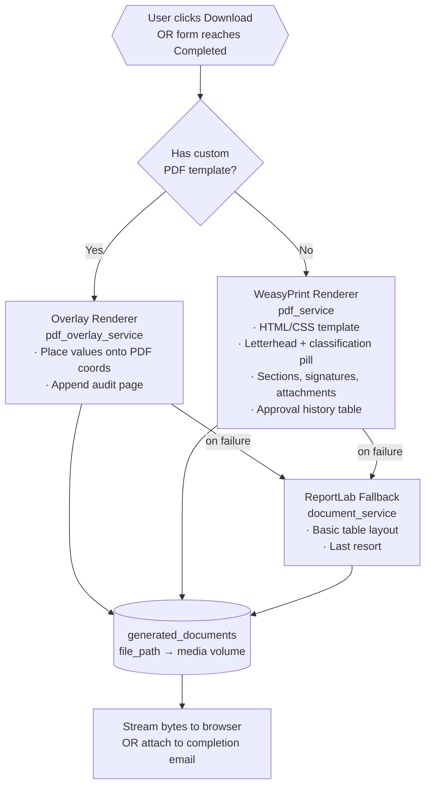

### Document access: who can see what

When a form completes, the system creates `document_shares` rows for:

- The **initiator** (the form creator).
- Every **approver** who signed it.
- All **CC recipients** named in the approval template.

The `/documents` endpoint returns only documents the user has a share for, **plus** all documents in their organisation if they are an Admin.

---

## 11. Email & Notifications

The system sends transactional emails at every meaningful event. All emails are queued as **background tasks** so the API responds to the user immediately, even if the SMTP server is slow.

| Event | Recipient | Email |
|---|---|---|
| User created | New user | Welcome + temporary password |
| Password reset requested | User | Reset link (24h expiry) |
| Form submitted | First approver | "Please approve" + form link |
| Step approved | Initiator | "X approved, now with Y" |
| Step approved | Next approver | "Please approve" |
| Form rejected | Initiator | "X rejected: see notes" |
| Form sent back | Initiator | "X needs corrections: see notes" |
| Form completed | Initiator + all approvers + CC | "Final signed document" + PDF attachment |

**SMTP configuration** is environment-driven (`SMTP_HOST`, `SMTP_USER`, `SMTP_PASS`, `SMTP_TLS`). The system supports any SMTP server: corporate Exchange, Microsoft 365, Gmail, or a dedicated transactional service.

---

## 12. Delegation Engine

When an approver is on leave, work can hand off to a delegate. The delegation engine is **automatic**: as soon as a form arrives, the system checks if the current approver has an active delegation and routes accordingly.

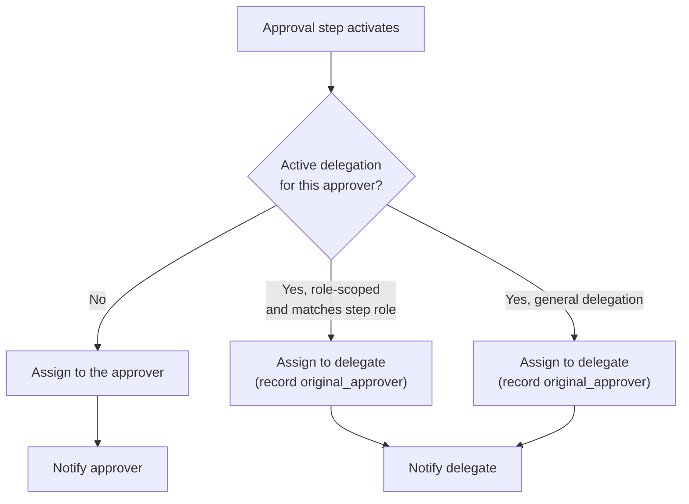

**Properties**

- Delegations have a **start date** and **end date** (or end manually).
- Delegations can be **role-scoped**: "John delegates only his Finance Approver role to Jane, not his Line Manager role".
- The audit log preserves both the **original approver** and the **delegate** for every step they handled.
- Admins can create or revoke delegations on behalf of any user.

---

## 13. Multi-Tenant Isolation

FlowDesk supports multiple organisations on a single deployment. Each is fully isolated.

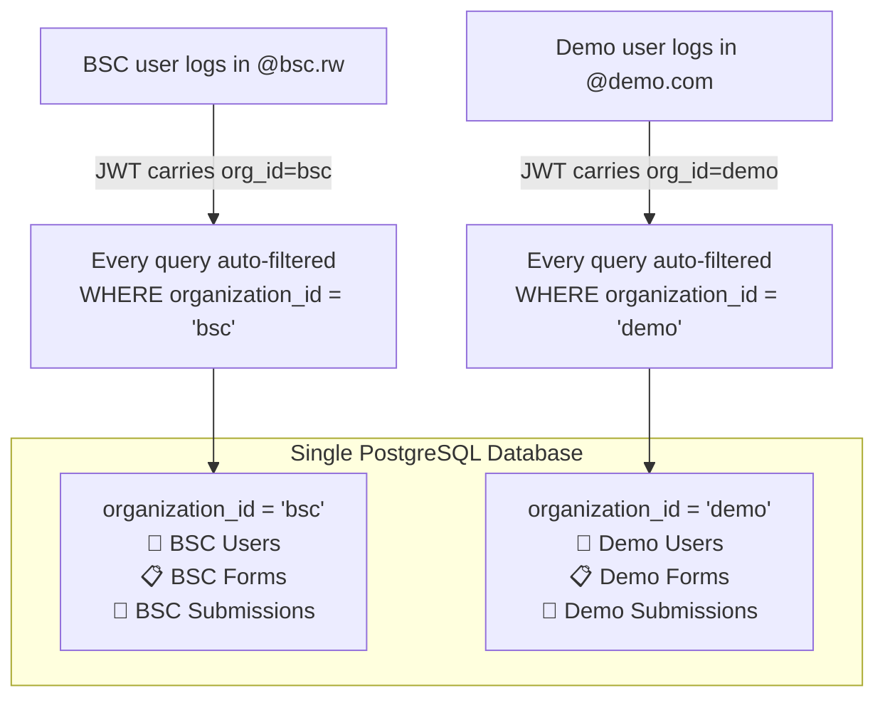

### How isolation is enforced

- **Login auto-detects** the organisation from the email domain (`email_domain` column on `organizations`).
- The **JWT token** embeds `organization_id`.
- The **`get_current_active_user`** dependency loads the user and exposes their `organization_id` to every endpoint.
- Every service query filters by `organization_id`. There is no code path that returns data from another tenant.

---

## 14. Security

### 14.1 Implemented controls

| Area | Control |
|---|---|
| **Authentication** | JWT bearer tokens, bcrypt password hashing (cost factor 12), TOTP MFA available |
| **Password policy** | Minimum 8 characters, upper + lower + digit + special character |
| **Forced reset** | Every user must change their temp password on first login |
| **Authorization** | `require_roles()` dependency on every admin endpoint |
| **Tenant isolation** | `organization_id` filter on every query |
| **Rate limiting** | 5/min on login, 100/min on general endpoints |
| **CORS** | Explicit allow-list via env var (no wildcards in production) |
| **Input validation** | Pydantic schemas on every endpoint |
| **SQL injection** | SQLAlchemy ORM with parameterised queries |
| **Audit log** | Every state change recorded with user, IP, timestamp |
| **Secret management** | `SECRET_KEY` required at startup (≥32 chars, no defaults) |
| **Error masking** | Production never leaks stack traces: generic error + request ID only |
| **Transport** | Designed to run behind HTTPS reverse proxy; `REQUIRE_HTTPS=true` enforces |

### 14.2 Known follow-ups (tracked in `SECURITY.md`)

- Token blacklist on logout (requires Redis)
- ClamAV malware scanning on uploaded attachments
- Field-level encryption for sensitive form values
- Move media to S3 with signed URLs for cloud deploys

### 14.3 Audit log

Every meaningful action writes a row to `audit_logs`:

| Captured | Example |
|---|---|
| `user_id` | Who did it |
| `action` | `FORM_SUBMITTED`, `STEP_APPROVED`, `USER_CREATED`, `STEP_REJECTED` |
| `entity_type` + `entity_id` | What was acted on |
| `details` (JSON) | Action-specific context (notes, reason, prior state) |
| `ip_address` | Where the request came from |
| `timestamp` | When |

Admins access this at `/logs` with filters by user, action, date range.

---

## 15. Deployment & Infrastructure

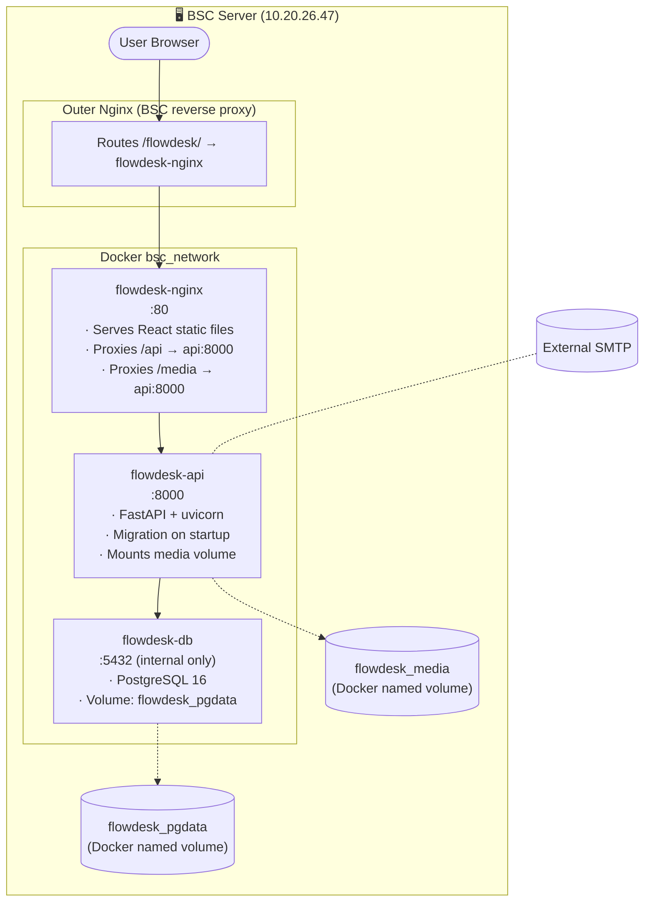

### Deployment specifics

- **Path:** `/opt/flowdesk` on the BSC server.
- **URL:** `http://10.20.26.47/flowdesk/` (intended to move to HTTPS at go-live).
- **Three containers:** all on the shared `bsc_network` Docker network so the outer proxy can address them.
- **Database not exposed** outside the Docker network: only reachable by the API container.
- **Persistent volumes:**
  - `flowdesk_pgdata`: PostgreSQL data files.
  - `flowdesk_media`: uploaded attachments, signatures, generated PDFs, letterhead images.
- **Automatic startup:** all containers `restart: unless-stopped`. PostgreSQL has a healthcheck; the API waits for the DB before starting.

### Deployment workflow

```bash
# On the server, in /opt/flowdesk
git pull
docker compose build api nginx     # rebuild whatever changed
docker compose up -d                # apply
```

Schema migrations run **automatically** at API startup: no manual DB step.

### Backup

| What | How | How often |
|---|---|---|
| Database | `pg_dump` against `flowdesk_pgdata` volume | Daily, off-host |
| Media | Volume snapshot or rsync of `flowdesk_media` | Daily |
| Code | Git repository | Continuous |
| `.env` (secrets) | Vault / secure off-host copy | On change |

---

## 16. Go-Live Readiness Checklist

### Functional coverage

- [x] User login + forced password reset on first login
- [x] MFA (TOTP) opt-in available
- [x] Admin creates users, departments, roles
- [x] Admin designs forms (with sections, validation, auto-fill, calculated fields)
- [x] Admin uploads PDF template per form for branded output
- [x] Admin designs approval workflows (hierarchy, role, specific user, optional steps)
- [x] Initiator submits, saves drafts, resubmits after correction
- [x] Approver approves / rejects / sends back with notes
- [x] Delegation (personal + admin-initiated, role-scoped)
- [x] Background email at every event
- [x] PDF generation (overlay + WeasyPrint + fallback)
- [x] Audit log on every action
- [x] Tenant isolation by org
- [x] Role-aware dashboards (Admin, Approver, Initiator, HOD, Executive, Report Manager, Observer)

### Pre-launch operational tasks

- [ ] Generate production `SECRET_KEY` (`openssl rand -hex 32`)
- [ ] Set `ENVIRONMENT=production` in `.env`
- [ ] Configure production `ALLOWED_ORIGINS`
- [ ] Switch to HTTPS at the outer proxy; set `REQUIRE_HTTPS=true`
- [ ] Configure production SMTP credentials
- [ ] Rotate database password (must not be `root:password`)
- [ ] Enable daily DB + media backups
- [ ] Confirm letterhead images uploaded for each tenant
- [ ] Smoke-test: submit → approve → completion → email arrives → PDF downloads
- [ ] Seed Admin user(s) and roles
- [ ] Train: pilot users on Submit + Approve flow; Admin team on form/template design

### Documents to hand over with go-live

- This blueprint (`FLOWDESK_BLUEPRINT.md`)
- `SECURITY.md`: security posture + pending follow-ups
- `.env.example`: required environment variables
- Admin user guide (form designer + approval template editor), _to be drafted_
- End-user one-pager (submit + approve), _to be drafted_

---

## 17. Glossary

| Term | Meaning |
|---|---|
| **Tenant / Organisation** | A separate customer/company on the platform. BSC is one tenant; demo is another. |
| **Initiator** | The person who starts (submits) a form. |
| **Approver** | A person assigned to approve, reject, or send back a form at a specific step. |
| **Approval template** | A reusable workflow definition (sequence of steps). |
| **Approval step** | A single point of approval in the chain, e.g., "Line Manager", "HR". |
| **Approval instance** | A live, in-flight approval step on an actual form (one per form per step). |
| **Form definition** | An admin-designed template: fields, validation, approval workflow attached. |
| **Form instance** | A single user's submission of a form. |
| **Form version** | A snapshot of values at submit time. New version on every resubmit. |
| **Send back** | An approver returning the form to the initiator for corrections (with notes). |
| **Delegation** | Hand-off of approval authority from one user to another for a time window. |
| **Hierarchy** | Manager / Senior Manager / Head of Department reporting structure. |
| **JWT** | JSON Web Token: the cryptographic ticket the browser presents to prove who you are. |
| **TOTP** | Time-based One-Time Password: the 6-digit code in Google/Microsoft Authenticator. |
| **WeasyPrint / ReportLab** | The two libraries that turn HTML into a PDF. |
| **Reference number** | Human-readable unique ID per form, e.g., `BSC-LRQ-2026-0042`. |

---

**End of blueprint.**

_For questions or corrections, contact the FlowDesk implementation team. This document should be updated whenever a structural change is made: new table, new endpoint group, new deployment topology._
